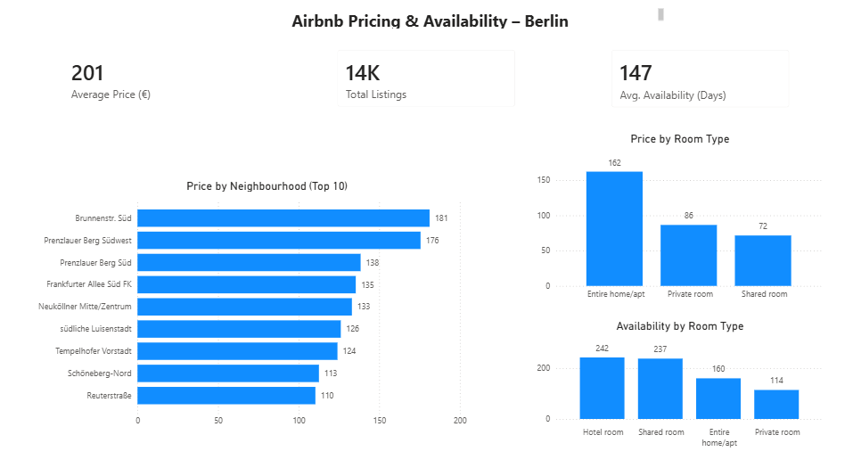

# Airbnb Berlin Data Analysis

## Project Overview
This project analyzes Airbnb listings in Berlin to understand pricing patterns, availability, and demand across different neighbourhoods and room types.

The analysis demonstrates an end-to-end data analyst workflow:
- Python for data cleaning and exploratory analysis
- SQL (PostgreSQL) for database-level analysis
- Power BI for interactive dashboarding

The focus is on clear business questions, reproducible analysis, and realistic tooling commonly used in industry.

---

## Dataset
The dataset contains Airbnb listings for Berlin and includes information such as:
- Listing price and room type
- Neighbourhood and location coordinates
- Availability and number of reviews
- Host and listing metadata

The raw dataset is stored unchanged to ensure reproducibility.

**Data location:**
data/raw/listings.csv

---

## Tools & Technologies
- **Python**: pandas, numpy, matplotlib
- **SQL**: PostgreSQL
- **BI Tool**: Power BI Desktop
- **Version Control**: Git & GitHub

---

## Analysis Workflow

### 1. Python Analysis
- Loaded and explored raw Airbnb data
- Checked data types, missing values, and distributions
- Handled missing prices using median price per room type
- Filtered extreme outliers for more robust analysis
- Analyzed:
  - Price distribution
  - Price by neighbourhood
  - Price by room type
  - Relationship between price and number of reviews
- Saved all figures for reproducibility

Notebook:
notebooks/airbnb_berlin_analysis.ipynb

---

### 2. SQL Analysis (PostgreSQL)
- Imported raw data into PostgreSQL
- Performed analysis directly in the database using SQL
- Used CTEs and aggregation functions
- Calculated median prices with `PERCENTILE_CONT`
- Answered the same business questions as in Python:
  - Price by neighbourhood
  - Price by room type
  - Price vs demand (reviews)

SQL scripts:
sql/
├── 01_table_creation.sql
├── 02_price_by_neighbourhood.sql
├── 03_price_by_room_type.sql
└── 04_price_vs_reviews.sql

---

## Power BI Dashboard
An interactive one-page dashboard was built in Power BI for stakeholder-style reporting.

The dashboard connects directly to PostgreSQL and provides a high-level overview of:
- Average price, total listings, and availability
- Price differences across neighbourhoods
- Price and availability by room type

Light filtering was applied to reduce the impact of extreme outliers while keeping the data close to its raw form.

**Dashboard file:**
dashboard/airbnb_berlin_dashboard.pbix

**Dashboard preview:**

---

## Key Insights & Practical Takeaways
- **Pricing Structure:** Entire homes and apartments command the highest prices across all neighbourhoods, while private and shared rooms consistently offer lower-cost options.
- **Location Effect:** Central neighbourhoods such as Prenzlauer Berg and Alexanderplatz show higher typical prices compared to outer districts, reflecting location-driven demand.
- **Affordability Options:** Shared and private rooms provide substantially lower prices than entire homes, making them suitable options for budget-conscious travelers.
- **Market Context:** With a large number of active listings, the Berlin Airbnb market appears competitive, with significant variation in pricing and availability across listings.

---

## Repository Structure
airbnb-berlin-analysis/
├── data/
│ └── raw/
│ └── listings.csv
├── notebooks/
│ └── airbnb_berlin_analysis.ipynb
├── sql/
│ ├── 01_table_creation.sql
│ ├── 02_price_by_neighbourhood.sql
│ ├── 03_price_by_room_type.sql
│ └── 04_price_vs_reviews.sql
├── dashboard/
│ └── airbnb_berlin_dashboard.pbix
├── figures/
│ ├── price_distribution.png
│ ├── price_by_neighbourhood.png
│ ├── price_by_room_type.png
│ ├── price_vs_reviews.png
│ └── powerbi_dashboard.png
└── README.md

---

## Notes
This project is designed as a junior data analyst portfolio project, focusing on clarity, correctness, and realistic workflows rather than advanced modeling or complex visual design.
